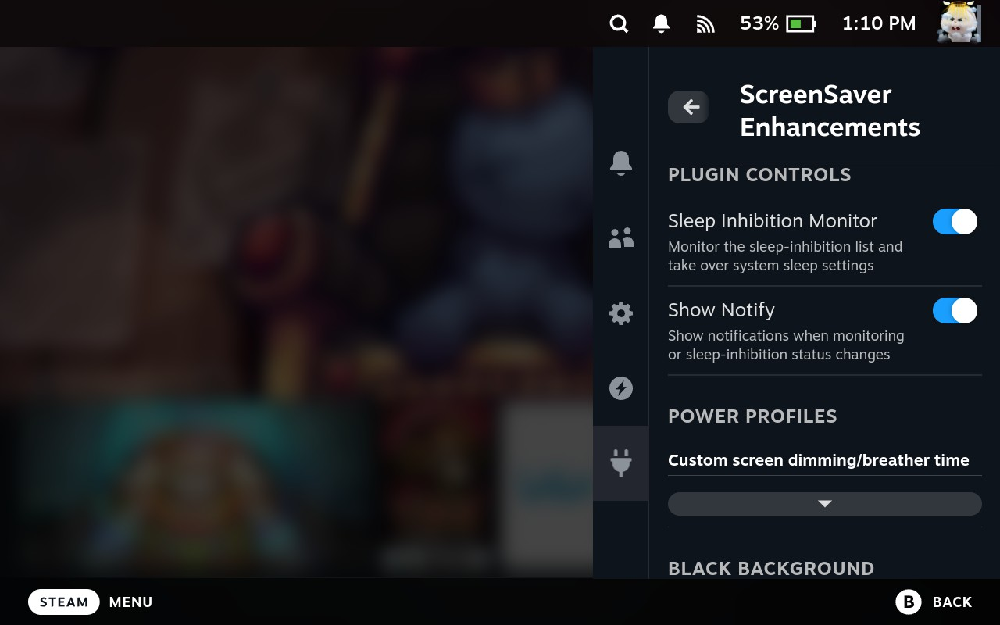
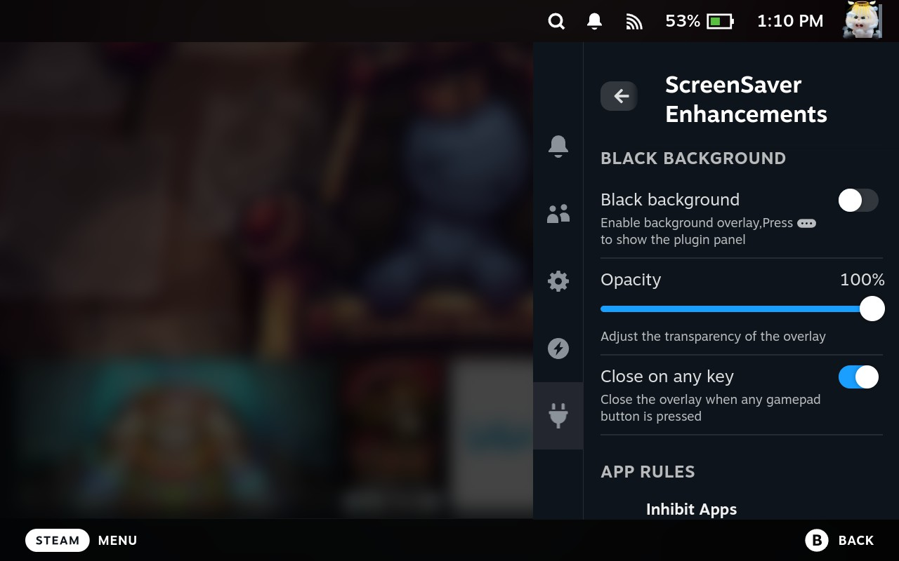
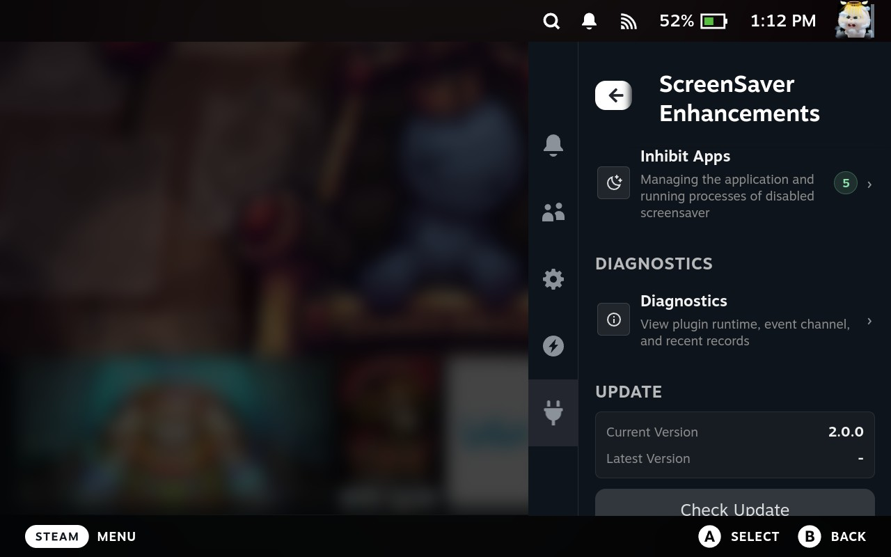
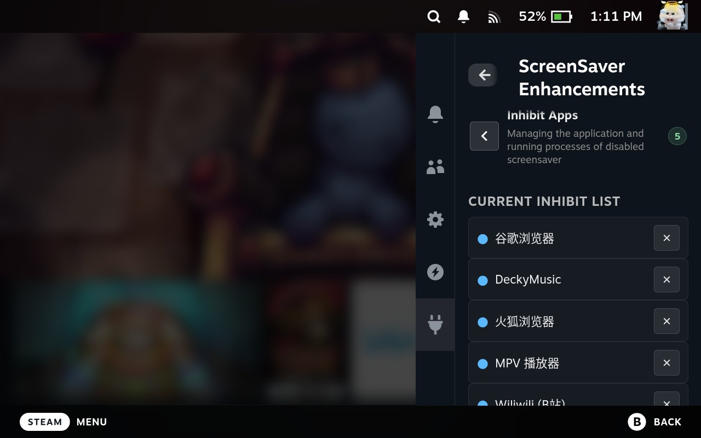
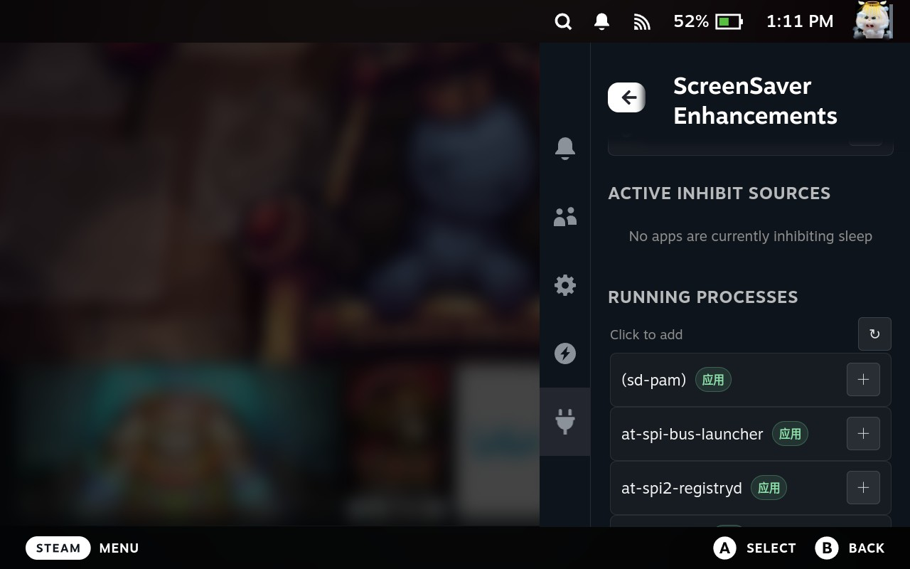
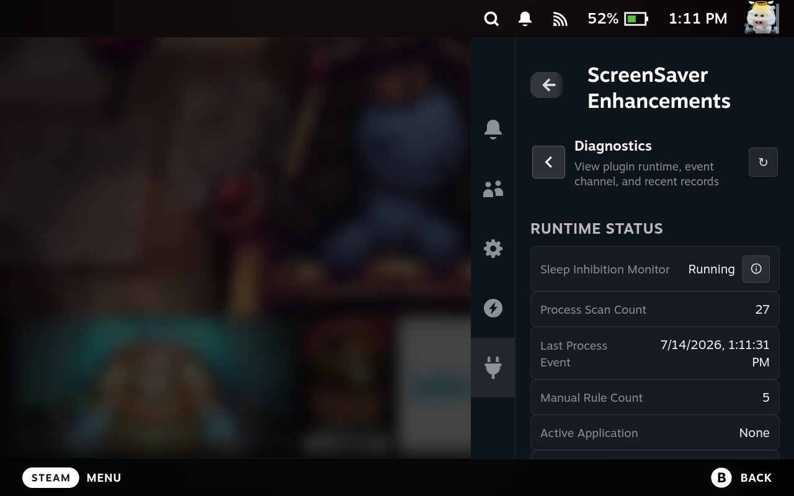
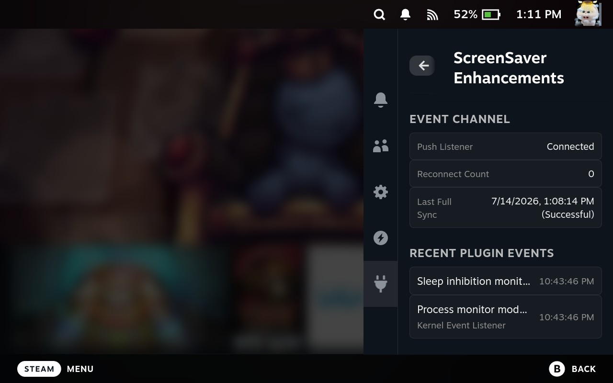
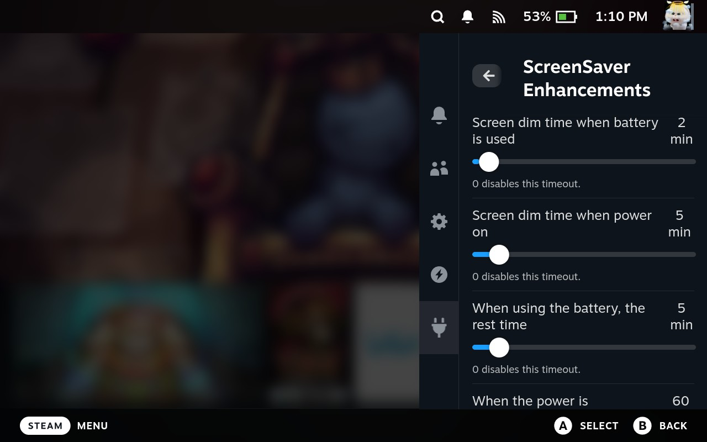

<div align="center">

# ScreenSaver Enhancements

[](https://github.com/Grails125/ScreenSaverEnhancements/releases/latest)
[](https://github.com/Grails125/ScreenSaverEnhancements/releases)
[](./LICENSE)

Keep your Steam Deck screen awake while media is playing or selected applications are running.

[中文说明](./README_ZH.md) | English

</div>

ScreenSaver Enhancements is a [Decky Loader](https://decky.xyz) plugin for Steam Deck. It handles standard D-Bus sleep-inhibition requests from supported media apps and can also monitor applications you choose yourself.

## Features

- **D-Bus sleep inhibition** — supports standard inhibition requests from apps such as VLC, Chrome, mpv, and wiliwili. *(v1.0.0)*
- **Power settings recovery** — saves the current SteamOS screen-dim and suspend configuration before taking control, then restores it when inhibition ends or recovery is needed. *(v1.0.0)*
- **Manual application rules** — choose running processes that should keep the screen awake, including Flatpak app IDs and full command lines. *(v1.0.0)*
- **DeckyMusic-aware playback detection** — detects actual audio playback from the backend only when a DeckyMusic rule is configured. It tolerates one short missed check before restoring normal sleep behavior, preventing false restores during track changes or brief stalls. *(v1.1.0, optimized in v2.0.0)*
- **Event-driven application monitoring** — listens for kernel process events when available and uses a 120-second fallback scan when necessary. DeckyMusic's 5-second audio check is independent, so it does not force repeated full process scans. *(v1.3.0, optimized in v2.0.0)*
- **Black display overlay** — optionally show a black overlay with adjustable opacity. *(v1.3.0)*
- **Separate battery and AC settings** — customize screen-dim and system-suspend timeouts for battery and external power, with two-way synchronization to the system settings. *(v2.0.0)*
- **V2 typed API and state synchronization** — uses Decky's modern typed RPC and push events for settings and inhibition state, with full-state reconciliation after a listener reconnect. *(v2.0.0)*
- **Diagnostics and updates** — inspect monitor mode, process activity, inhibition source, D-Bus requests, power override state, recent events, and event-channel health; copy the report or update from the plugin panel. *(v2.0.0)*
- **Reliable lifecycle handling** — waits for pending inhibition notifications to cancel during unload/restart and packages all required backend modules with the release. *(v2.0.0)*

## Screenshots

### Main panel

| Monitor and main controls | Mask switches and settings | App rules, diagnostics, and update entry points |
| --- | --- | --- |
|  |  |  |

### Application rules

| Configured inhibit list | Running-process selection |
| --- | --- |
|  |  |

### Diagnostics and power profiles

| Runtime diagnostics | Recent diagnostic events |
| --- | --- |
|  |  |



## Install

### Prerequisite

Install [Decky Loader](https://decky.xyz) first. If it is not installed, run the official installer on the Steam Deck:

```sh
curl -L https://github.com/SteamDeckHomebrew/decky-installer/releases/latest/download/install_release.sh | sh
```

### Release package

1. Download `ScreenSaverEnhancements.zip` from the [latest release](https://github.com/Grails125/ScreenSaverEnhancements/releases/latest).
2. Open **Decky Settings** → **Developer** → **Install Plugin from ZIP**.
3. Select the downloaded ZIP package and complete the installation.

### Build from source

```powershell
npm.cmd install
npm.cmd test
python build.py
```

The package is created at `build/ScreenSaverEnhancements.zip`. Install it using the release-package steps above.

## Upgrade

The plugin can check for updates from the bottom of its panel. When a newer release is available, open the update section, review the version and release notes, then start the upgrade there.

To upgrade manually, download the latest release package, then select it through **Decky Settings** → **Developer** → **Install Plugin from ZIP**.

## Uninstall

1. Open **Decky Settings** → **Plugins**.
2. Find **ScreenSaver Enhancements** and select **Uninstall**.
3. Confirm the uninstall when prompted.

## How it works

The plugin uses two complementary sources of inhibition:

- **D-Bus mode** registers standard sleep-inhibition services. When an application calls `Inhibit`, the backend pushes a state update and the frontend applies the configured SteamOS power behavior.
- **Manual mode** watches the configured process rules. It prefers process events and automatically switches to low-frequency scanning when the event source is unavailable.

DeckyMusic is a specialized manual rule: its audio state is checked every five seconds only while the rule is configured. Normal manual application rules remain event-driven, with a 120-second fallback scan, so the two paths do not multiply process-scanning work.

Both sources share the same state synchronization and power-control path. Before overriding power behavior, the plugin records the current settings; once every inhibitor ends, it restores that saved configuration instead of writing fixed defaults.

## Development

| Command | Description |
| --- | --- |
| `npm.cmd install` | Install frontend dependencies. |
| `npm.cmd test` | Run TypeScript validation and discovered JavaScript and Python tests. |
| `npm.cmd run build` | Build the frontend bundle. |
| `python build.py` | Build the installable plugin directory and ZIP package. |

## Credits

- [xfangfang/DeckyInhibitScreenSaver](https://github.com/xfangfang/DeckyInhibitScreenSaver) — the project this plugin extends.
- [Decky Loader](https://github.com/SteamDeckHomebrew/decky-loader) — Steam Deck plugin loader and platform.

## License

This project is licensed under the [BSD 3-Clause License](./LICENSE).
