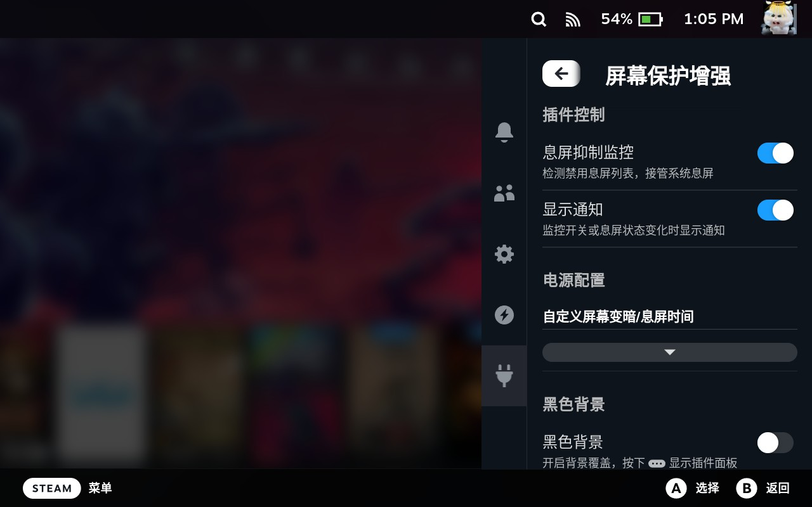
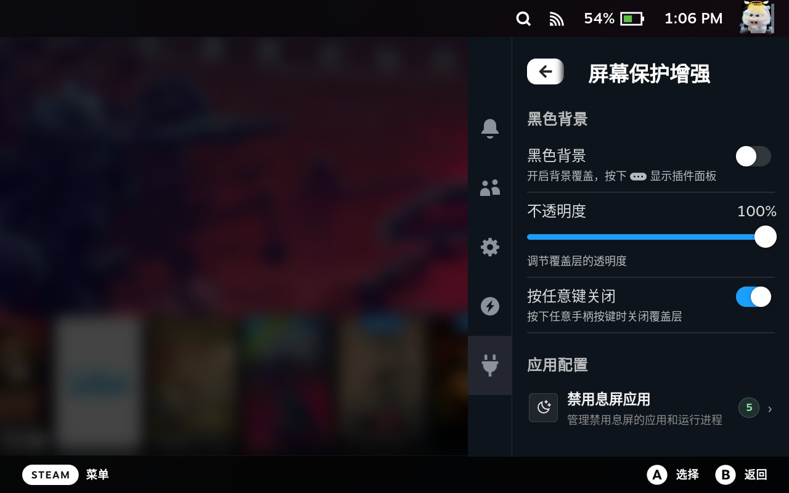
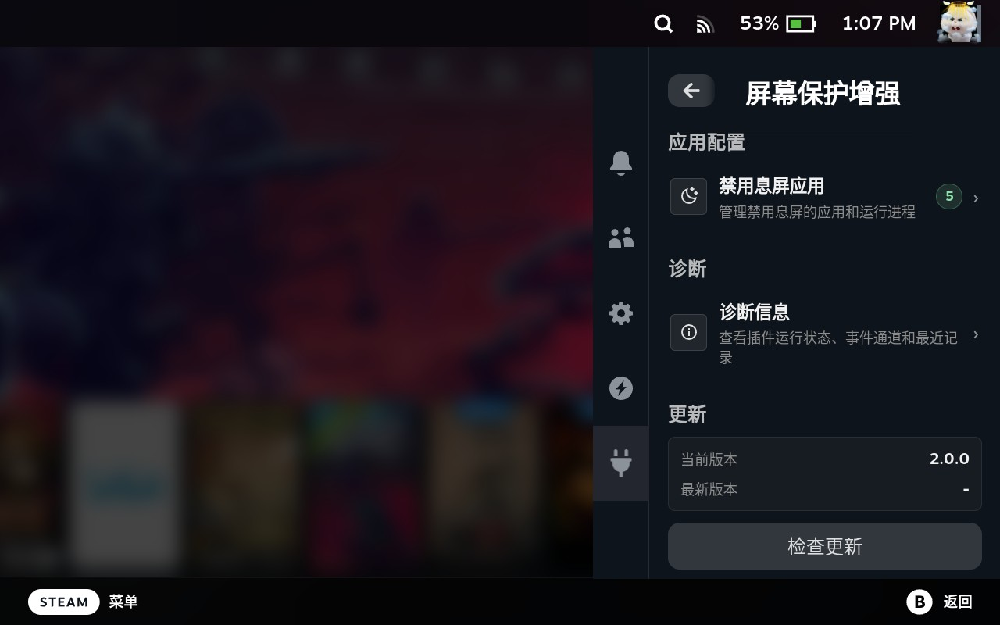
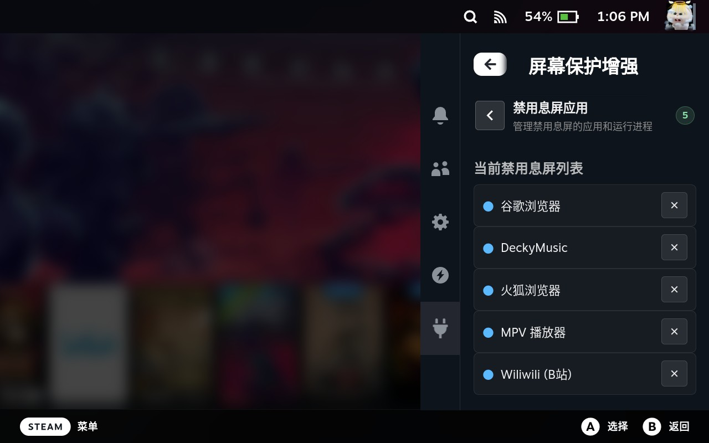
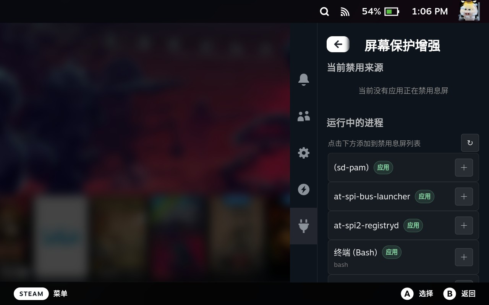
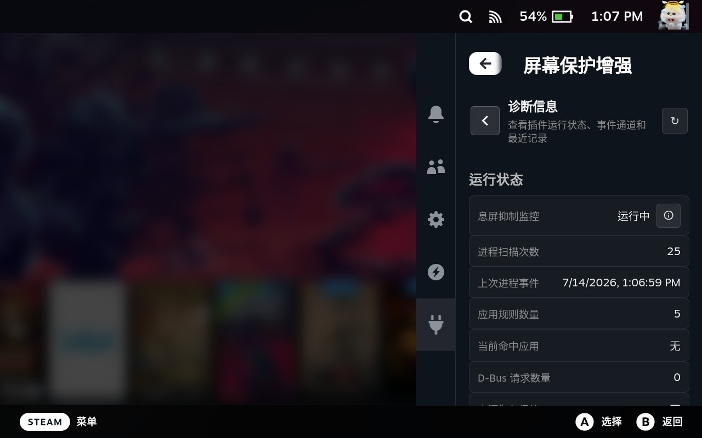
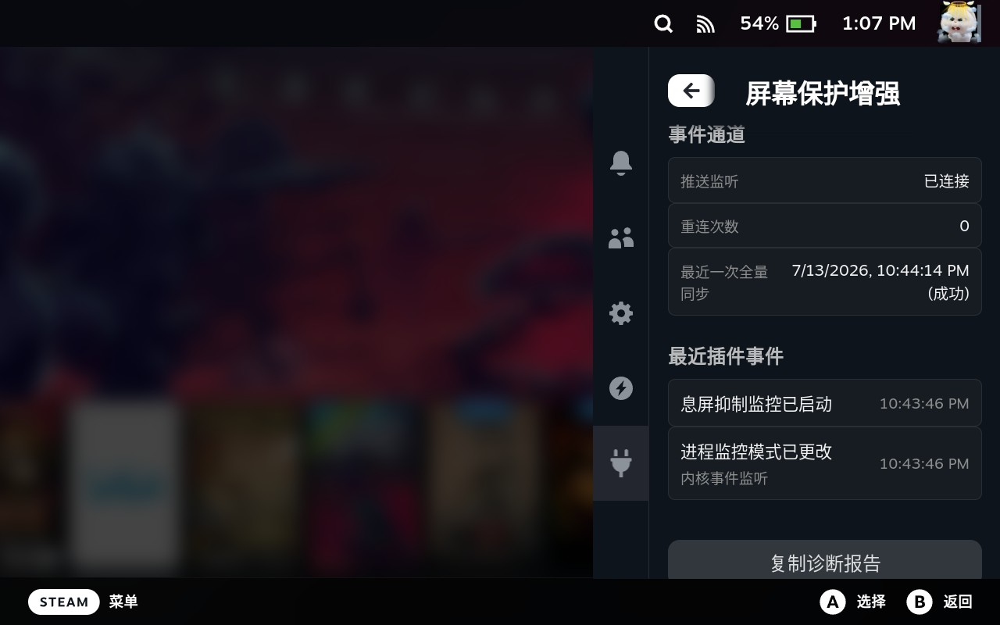
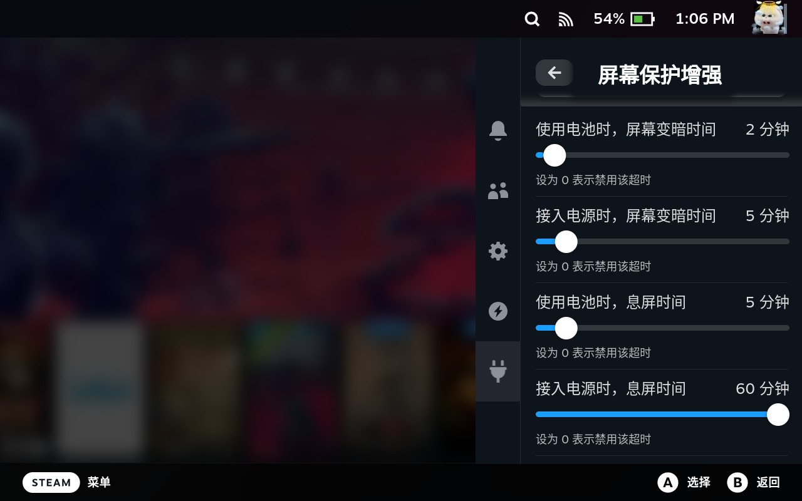

ScreenSaver Enhancements 是一个用于 Steam Deck 的 [Decky Loader](https://decky.xyz) 插件。它可以处理受支持媒体应用发出的标准 D-Bus 息屏抑制请求，也可以监控你手动选择的应用。

## 功能

- **D-Bus 息屏抑制**：支持 VLC、Chrome、mpv、wiliwili 等应用的标准抑制请求。*（v1.0.0）*
- **电源设置恢复**：接管前保存当前 SteamOS 的调暗与休眠配置；抑制结束或需要恢复时自动还原。*（v1.0.0）*
- **手动应用规则**：选择需要保持亮屏的运行中进程，支持 Flatpak 应用 ID 和完整命令行匹配。*（v1.0.0）*
- **DeckyMusic 播放检测**：不会仅因 DeckyMusic 进程常驻就持续抑制息屏；仅在配置 DeckyMusic 规则后由后端检测实际音频播放。连续一次短暂未检测到音频不会立即恢复息屏，可避免切歌或短暂卡顿误判。*（v1.1.0，v2.0.0 优化）*
- **事件驱动的应用监控**：优先监听内核进程事件；不可用时每 120 秒低频兜底扫描。DeckyMusic 的 5 秒音频检测与普通应用进程扫描解耦，不会额外触发完整进程扫描。*（v1.3.0，v2.0.0 优化）*
- **黑色显示遮罩**：可选黑色遮罩，支持透明度调整。*（v1.3.0）*
- **电池与外接电源分别配置**：可自定义设置电池和外接电源模式下的调暗、系统休眠超时并与系统设置双向同步。*（v2.0.0）*
- **V2 类型化接口与状态同步**：使用 Decky 现代类型化 RPC 和状态推送处理设置、息屏抑制状态；监听恢复后会进行完整状态同步。*（v2.0.0）*
- **诊断与更新**：可查看监控模式、进程活动、禁用来源、D-Bus 请求、电源覆盖状态、最近事件与事件通道健康度；支持复制诊断报告，并可在插件面板内检查更新。*（v2.0.0）*
- **可靠的生命周期处理**：卸载或重启时会等待待处理的息屏状态通知取消完成，并确保发布包包含全部后端模块。*（v2.0.0）*
- **Decky Music MPRIS 播放监听**：通过公开的 MPRIS 播放状态事件识别新版 Decky Music，同时保留旧版 DeckyMusic 的兼容路径；播放状态变化不再需要反复进行完整进程扫描。*（v2.0.1）*
- **更清晰的诊断信息**：最近插件事件仅保留最新 40 条，可在诊断页清空；现在会标明增加/减少息屏规则，以及禁用/恢复息屏的具体应用。*（v2.0.1）*
- **运行中应用列表优化**：保留 Unicode 进程名称，避免本地化名称重复显示，并改善应用规则页的刷新反馈与滚动体验。*（v2.0.1）*
- **更安全的设置持久化**：保存前校验设置值，规范化已持久化数据，并保留损坏的设置文件以便恢复，不再静默丢弃。*（v2.0.2）*

## v2.0.2 更新说明

- 拒绝无效设置值，并在持久化前规范化有效的应用规则。
- 启动时将无效的已保存公开设置恢复为安全默认值。
- 将损坏的设置文件保留为带 `.corrupt` 后缀的备份，便于排查与恢复。

## 截图

### 主面板

| 监控与主要控制                                         | 遮罩开关与设置                                         | 应用规则、诊断与更新入口                                         |
| ------------------------------------------------------ | ------------------------------------------------------ | ---------------------------------------------------------------- |
|  |  |  |

### 禁用息屏应用

| 已配置的禁用列表                                            | 运行中进程选择                                            |
| ----------------------------------------------------------- | --------------------------------------------------------- |
|  |  |

### 诊断与电源策略

| 运行时诊断                                            | 最近诊断事件                                            |
| ----------------------------------------------------- | ------------------------------------------------------- |
|  |  |



## 安装

### 前置条件

请先安装 [Decky Loader](https://decky.xyz)。如尚未安装，可在 Steam Deck 上运行官方安装命令：

```sh
curl -L https://github.com/SteamDeckHomebrew/decky-installer/releases/latest/download/install_release.sh | sh
```

### 使用发布包安装

1. 从[最新发布页](https://github.com/Grails125/ScreenSaverEnhancements/releases/latest)下载 `ScreenSaverEnhancements.zip`。
2. 打开 **Decky 设置** → **开发者** → **从 ZIP 安装插件**。
3. 选择下载的 ZIP 包并完成安装。

### 从源码构建

```powershell
npm.cmd install
npm.cmd test
python build.py
```

构建产物位于 `build/ScreenSaverEnhancements.zip`，然后按上述发布包安装步骤安装即可。

## 更新

插件面板底部提供更新检查功能。发现新版本后，可在更新区域查看版本与发布说明，并直接开始升级。

也可以手动下载最新发布包，然后在 **Decky 设置** → **开发者** → **从 ZIP 安装插件** 中选择该 ZIP 包完成升级。

## 卸载

1. 打开 **Decky 设置** → **插件**。
2. 找到 **屏幕保护增强**，选择 **卸载**。
3. 根据提示确认卸载。

## 工作原理

插件通过两种互补的方式决定是否保持亮屏：

- **D-Bus 模式**：注册标准息屏抑制服务。应用调用 `Inhibit` 后，后端会推送状态更新，由前端按配置接管 SteamOS 的电源行为。
- **手动模式**：监控已配置的进程规则。优先使用进程事件；事件源不可用时自动改用低频扫描。

DeckyMusic 属于专用的手动规则：只有配置该规则后才会每 5 秒检测一次音频状态。普通手动应用仍以事件驱动为主，并以每 120 秒扫描兜底；两条路径彼此独立，不会叠加进程扫描负担。

两种方式共用同一套状态同步和电源控制流程。接管电源行为前，插件会记录当前设置；所有抑制结束后，会恢复这份保存的配置，而不是写入固定的默认值。

## 开发

| 命令                  | 说明                                                           |
| --------------------- | -------------------------------------------------------------- |
| `npm.cmd install`   | 安装前端依赖。                                                 |
| `npm.cmd test`      | 运行 TypeScript 校验，以及已发现的 JavaScript 和 Python 测试。 |
| `npm.cmd run build` | 构建前端包。                                                   |
| `python build.py`   | 构建可安装的插件目录和 ZIP 包。                                |

## 致谢

- [xfangfang/DeckyInhibitScreenSaver](https://github.com/xfangfang/DeckyInhibitScreenSaver)：本项目扩展自该插件。
- [Decky Loader](https://github.com/SteamDeckHomebrew/decky-loader)：Steam Deck 插件加载器和平台。

## 许可证

本项目使用 [BSD 3-Clause License](./LICENSE)。
