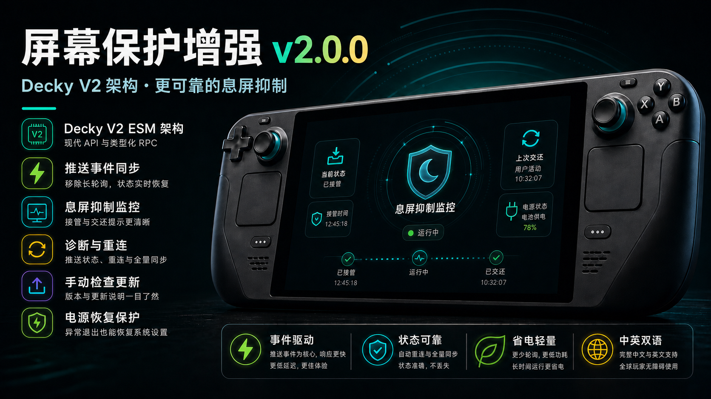
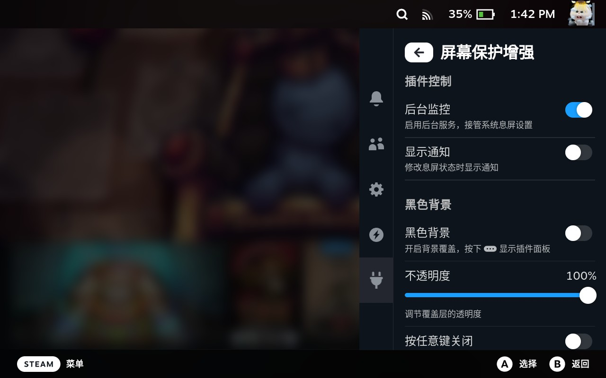
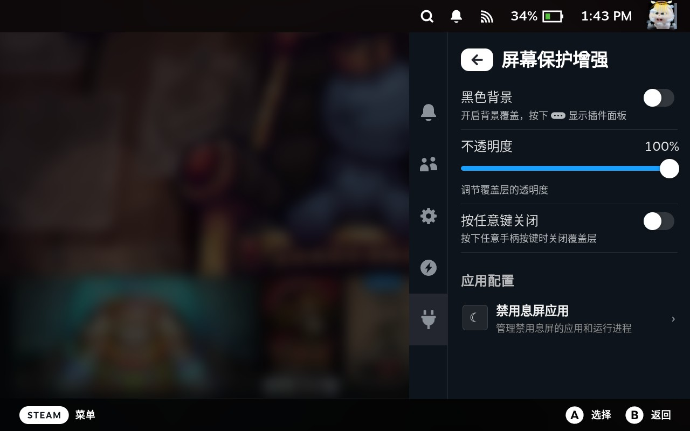
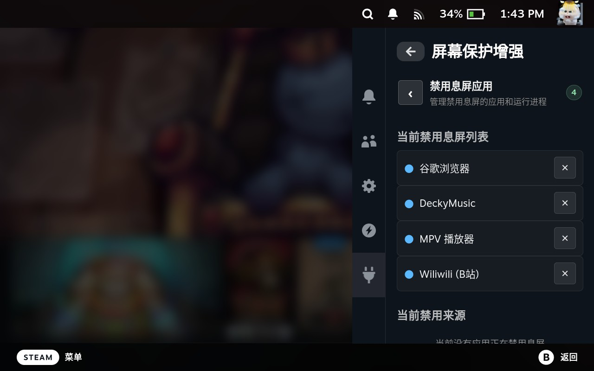
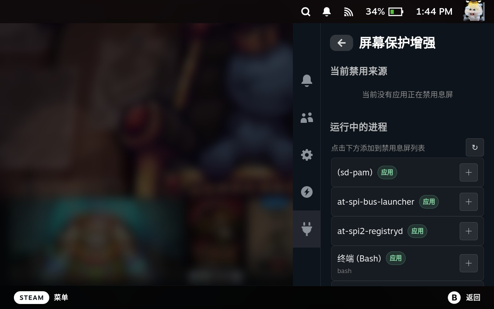

# ScreenSaver Enhancements（屏幕保护增强）

[English](./README.md)

ScreenSaver Enhancements 是一个 Steam Deck 的 Decky Loader 插件，用于在视频播放、网页浏览、音乐播放或指定应用运行时阻止屏幕调暗和系统休眠。

本项目基于 [xfangfang/DeckyInhibitScreenSaver](https://github.com/xfangfang/DeckyInhibitScreenSaver) 扩展，保留原版 D-Bus 抑制休眠能力，并新增手动进程监听和更完整的管理界面。

## 更新内容

### 2.0.0



#### V2 架构升级

- 前端迁移到 Decky V2 ESM 架构，使用 `@decky/api`、`@decky/ui` 和 typed callable RPC。
- 后端迁移到现代 `decky` 模块，移除 legacy RPC 适配器与事件长轮询。
- 设置与息屏抑制状态改为 Decky 推送事件，结合全量状态同步处理丢失、乱序和重连恢复。
- 增加电源覆盖恢复快照和失联 D-Bus 客户端巡检，异常退出后也能恢复系统息屏配置。

#### 功能与体验

- “后台监控”升级为“息屏抑制监控”，开关通知明确区分接管与交还系统息屏。
- 支持分别自定义电池与电源模式下的屏幕调暗、系统休眠时间；息屏抑制结束后恢复用户配置。
- 诊断页融合监控状态与进程监听模式，增加推送监听、重连次数和最近全量同步结果。
- 增加手动检查更新、版本信息和更新说明，并将检查更新区域放在插件面板最下方。
- 修复关闭监控后 DeckyMusic 仍可能保持息屏抑制的问题。

### 1.3.0

#### 新增与改进

- 增加黑色遮罩显示开关、透明度调节。
- 优化功能区分，将禁用息屏应用配置移至二级页面。
- 优化新版 SteamOS 和 SteamClient API 的兼容性。

### 1.2.0

#### 新增与改进

- 前端轮询间隔 1s → 3s，IPC/后端负载降低 3x。
- 设置检查频率 5s → 30s，IPC 调用减少 6x。
- UI 进程列表刷新 10s → 30s，`ps` 子进程调用减少 3x。
- 移除每秒 DOM 全量扫描 `querySelectorAll('audio')`。
- `installAudioTracker` 改用共享函数替代每次 `play` 创建闭包，减少 GC 压力。
- 后端 `get_event()` 移除重复的进程检查调用，`ps` 命令频率从每秒降到每 5–10 秒。
- `_manual_watch_loop` 自适应轮询：空闲 10s / 活跃 5s，空闲时 CPU 使用降低 83%–91%。

### 1.1.0

#### 新增与改进

- 修复手动阻止休眠列表对新应用不生效的问题。
- 增强进程匹配能力：支持短进程名、完整启动参数、长可执行文件名和 Flatpak App ID。
- 新增 DeckyMusic 特殊处理：不再因为 DeckyMusic 插件进程常驻就一直阻止休眠，只有检测到真实音频播放时才阻止休眠。
- 优化 D-Bus 自动阻止休眠与手动进程阻止休眠的状态合并逻辑。

## 功能

- **D-Bus 自动抑制**：兼容 VLC、Chrome、mpv、wiliwili 等会主动发送 inhibit 请求的应用。
- **手动进程监听**：可以把正在运行的进程加入阻止休眠列表，只要目标进程存在就保持屏幕常亮。
- **更稳的进程匹配**：支持短命令名、完整命令行、长可执行文件名和 Flatpak app id。
- **后端常驻监听**：手动进程扫描在插件后端运行，不依赖 Decky 面板一直打开。
- **DeckyMusic 特殊处理**：不会因为 DeckyMusic 插件进程常驻就一直阻止休眠；如果列表中启用了 DeckyMusic，则只在真实音频播放时阻止休眠。
- **开机自启**：Decky Loader 启动后可自动启动后台监听。

## 截图

| 主面板 | 设置面板 |
| --- | --- |
|  |  |
|  |  |

## 安装

1. 安装 [Decky Loader](https://decky.xyz)。
2. 构建或下载 `ScreenSaverEnhancements.zip`。
3. 解压后把 `ScreenSaverEnhancements` 文件夹放到：
   `/home/deck/homebrew/plugins/`
4. 重启 Steam，或在 Decky 菜单中重新加载插件。

## 工作方式

插件有两条触发路径：

- **D-Bus 模式**注册标准息屏抑制服务。应用调用 `Inhibit` 后，后端通过 Decky 推送发出状态变化信号，前端获取完整状态并接管 SteamOS 的调暗和休眠设置。
- **手动模式**优先监听内核进程事件，无法使用时自动切换为低频扫描。命中配置列表后，与 D-Bus 模式共用同一套状态同步和电源控制流程。

开始抑制时会保存当前系统电源配置；当所有自动和手动抑制都结束，或插件异常恢复时，会还原该快照，而不是写入固定默认值。

## DeckyMusic

DeckyMusic 是一个常驻插件进程，单纯按进程名监听会导致它即使暂停播放也一直阻止休眠。因此本插件会在后端进程匹配中跳过 DeckyMusic。

如果阻止列表中包含 `DeckyMusic`，前端会监听真实的 HTML 媒体播放状态，只在音频实际播放时阻止休眠。

## 开发

```powershell
npm.cmd install
npm.cmd test
python build.py
```

`npm.cmd test` 会执行 TypeScript 校验和已发现的单元测试。构建产物会输出到 `build/ScreenSaverEnhancements` 和 `build/ScreenSaverEnhancements.zip`。
